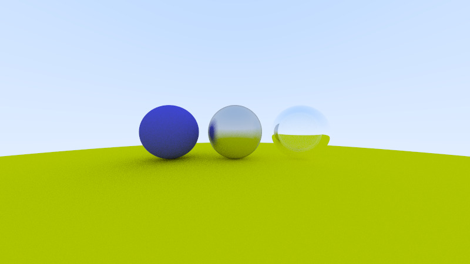

# Gotracer

Following the amazing [Ray Tracing in One Weekend](https://raytracing.github.io/books/RayTracingInOneWeekend.html) I am implementing a simple raytracer in Go. As I learn more about the language I will refactor the code aiming to make it more and more idiomatic. 

## Current state

